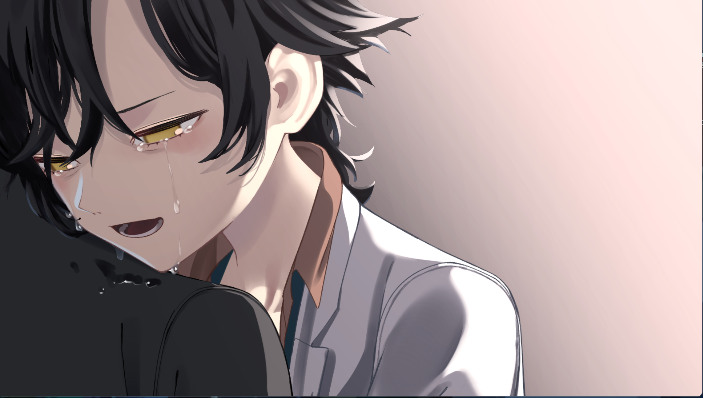

# The Tulip Redemption

I started playing *HENPRI* during winter break and recently finished the true ending. By coincidence, I also watched *The Shawshank Redemption* around the same time. It was only while watching the film that I realized just how many nods to Shawshank *HENPRI* contains.

> *HENPRI* (ヘンタイ・プリズン, "Hentai Prison") is an exhibitionist prison-break visual novel released by Qruppo on January 28, 2022, written by Kurashiki Toshihito and Kamichika Yuu, with art by Ukimaru Tsubone, Kisaragi Chiyuki, and Ichitorei. It landed on Steam via Shiravune on March 4, 2025 with official Chinese localization. The game won first place in the overall category at the 2022 Moe Game Awards and the Grand Prize at the 2022 Bishoujo Game Awards, earning it the player-given title "the Shawshank Redemption of the galgame world."

> The story takes place in Tulip Prison, a phantom ninth correctional district built on a remote island, designed specifically to house sexual offenders deemed "beyond redemption" nationwide. The protagonist, Minato Shuuichirou (Inmate #0720), is sentenced to ten years for insisting that "full nudity is art" and repeatedly exposing himself in public, and is shipped off to this theoretically inescapable cage.

## Formal Homages

The most obvious parallel is the prison fixer, Kugitani Youji (Inmate #0126). Known as "the Elder of Tulip Prison," he shares Red's role as someone who can procure goods from the outside world. Whatever Minato Shuuichirou asks for, he can get his hands on. Kugitani is deeply trusted by the inmates, trades in information through sheer personal influence, carries himself with seasoned composure, takes a liking to the protagonist, and frequently offers advice — he is Red reincarnated in Tulip Prison. And the scene at the end of the true route where Shuuichirou redeems Kugitani is a clear homage as well; honestly, the true ending exists precisely to set up that moment.

Then there's the classic poster-over-the-hole trick. What *HENPRI* improves upon Shawshank, though, is patching the bug — adding a layer of wallpaper so the hole won't be exposed during a routine cell inspection.

And finally, the iconic rain scene. After his successful escape, the protagonist stands in the downpour with arms outstretched, embracing freedom — a direct echo of Andy's rebirth in the thunderstorm. Just look at the CGs. No words needed.

## Carrying Forward and Transcending the Core

If the homages above are merely formal, *HENPRI* also inherits the very essence of Shawshank at its core.

*The Shawshank Redemption* is a story about prison, institutionalization, and freedom. Its discussion of freedom, however, is arguably a bit stretched. Andy, from the moment he enters prison, is already a sound soul — he needs no redemption from others. The instant he realizes he wasn't the one who killed his wife, he has already redeemed himself. Whether he escapes or not doesn't really matter to Andy; his spirit was free from the very beginning. The escape is something the director/author designed to resonate with the audience, granting him physical freedom to match.

But our Minato Shuuichirou is different. As Correctional Officer Higuchi Eriko puts it, Shuuichirou is, at the start, nothing more than a child — he doesn't understand what freedom is, what love is, what responsibility is, what respect is. And so, our three heroines take the stage.

Kurebayashi Noah (Inmate #0721, alias "Drone Girl") teaches Shuuichirou the love between sisters. A voyeur who uses drones to film and sell pornographic shorts, she is aloof, solitary, her words keeping everyone at arm's length. Yet her cold pride is only a shield — everything she does is to rescue her sister, Chief Guard Sofia Shikorenko, who has been "brainwashed" by the prison. Through their journey from transactional cooperation to mutual support in a shared escape plan, Shuuichirou gradually comes to understand what an unbreakable bond truly means.

Hatae Taeka (Inmate #0019, alias "Boss") teaches Shuuichirou the weight of a gang leader's responsibility. The daughter of the Hatae-gumi yakuza clan's boss, she inherits the group after her father's death and deliberately gets herself imprisoned to investigate a drug case. As the prison's unofficial "head inmate," she acts only on reason and evidence, always standing on the right side of things. Fighting alongside her, Shuuichirou learns what it means to bear responsibility.

Kurogane Isumi (Inmate #1310, alias "Bomber," pen name Chisato) teaches Shuuichirou what respect is. Born into a family of fireworks artisans, she lost both parents and was abused at an orphanage because of her distinctive right eye, eventually blowing the place up and landing in prison. Working as a blaster in the mines, she rarely speaks due to a stutter, yet quietly submits poetry to the prison newspaper. Her very existence is a testament to dignity.

With them by his side, Minato Shuuichirou grows. He grows into a true man.

## Artistic Creation as a Metaphor for Freedom

There's an unforgettable scene in Shawshank: Andy locks himself in the warden's office and plays Mozart's *The Marriage of Figaro* over the prison loudspeakers. The Italian opera drifts across the exercise yard, every inmate stopping to listen — and in that moment, everyone feels free. Red's narration goes: "Those two Italian ladies sang across the prison walls, into the hearts of every man. I have no idea to this day what they were singing about. Truth is, I don't want to know. Some things are better left unsaid. There are places in this world that aren't made of stone. There's something inside that they can't get to, that they can't touch. It's yours." The cost: two weeks in the hole for Andy.

In *HENPRI*, Shuuichirou's mode of free expression is making galgames. In the rehabilitation center's computer lab, he forms a team with the three heroines — Kurebayashi Noah handles programming and UI, Chisato writes the script, Hatae Taeka provides connections and resources — and together they create an adult game. This isn't a momentary act of rebellion but sustained, systematic self-expression. Shuuichirou pours his desires, his ideals, his entire understanding of the world into the game. If exhibitionism is fundamentally about "letting the world see your true self," then making galgames is how he finds a way for the world to accept him.

The prison's response, however, is starkly different. Andy's transgression is met immediately with solitary confinement — brutal and direct. Shuuichirou faces something more insidious. After the demo is finished, the prison administration shuts down the rehabilitation program on the grounds of "indirectly assisting others in masturbation." This isn't as nakedly oppressive as solitary confinement; it's a more thorough negation — not merely forbidding your actions, but fundamentally denying the meaning of your expression. Your creative work, in their framing, is nothing more than a masturbatory aid.

But the biggest difference lies in the ending. After Andy plays the record, the music fades, the solitary confinement ends, and everything returns to how it was. A moment of beauty crushed by the system — though it left an indelible mark on the prisoners' hearts. Shuuichirou's galgame project is also forcibly terminated, but the spark doesn't die. In the true ending, he escapes to Seiran Island and continues making galgames. Creative work evolves from a prison pastime, to an act of forbidden resistance, and finally into his foothold in the world beyond the walls. Shuuichirou didn't gain freedom *because* he escaped — the door to freedom had already opened the moment he found his true mode of expression. The escape merely let his body catch up with his soul.

Shawshank tells us that art can create fleeting moments of freedom within a cage. *HENPRI* goes one step further: art is not merely a means of escaping reality — it is a weapon for changing reality. When the system denies your expression, what you need isn't to stop expressing yourself, but to become strong enough that the system *can't* deny you.

In the true ending (the Grand Route), Shuuichirou allies with Warden Mizushiro to defeat the three chief guards one by one: the blonde bombshell Sofia Shikorenko of the indecency ward (alias "Soft Ethics," a discipline fanatic who views inmates as scum); the queen bee Yuugao Hazuki of the major crimes ward (alias "Queen Bee," the de facto power broker, sadistic and cruel, ruling through electric torture); and the nun Gatsumi Juria of the sexual offenses ward (alias "Sister Juria," who maintains a serene facade and never scolds inmates while secretly conducting unspeakable deeds behind the scenes). But this also concentrates power excessively in the warden's hands. Unlike Shawshank, Shuuichirou doesn't fight alone — he has the companions he's gathered along the way. The climactic, shounen-style finale goes exactly as you'd expect: the classic overthrow of authority. On the day of his execution, when the warden condemns him to death as an "innate-type criminal," the inmates and correctional staff rise up together to help him escape. Shuuichirou eventually makes his way to Seiran Island, where he continues making galgames — but that's a story for another time.

And so we see Minato Shuuichirou redeemed by the three heroines, and then redeeming them in turn, ~~along with the supplier Kugitani Youji~~. Our Shuuichirou grows from the child he was at the beginning into a true man. Truly, a cause for celebration.

(Actually, the doctor did a lot too — but why is there no doctor route?)

## Individual Escape vs. Collective Rescue

This is the most fundamental difference between the two works' narratives.

Andy's escape is pure individual heroism. He spends twenty years digging through a wall with a tiny rock hammer hidden inside a Bible, crawls through five hundred yards of sewage pipe on a thunderstorm night, and finally stands alone in the rain, free. Red says: "Some birds aren't meant to be caged. Their feathers are just too bright." This is a story about individual will triumphing over the system — as long as you're resilient enough, smart enough, patient enough, no cage can hold you. Out of the entire prison, only Andy walks free.

But this also means that after Andy escapes, Shawshank Prison barely changes. Warden Norton commits suicide, Captain Hadley is arrested, but the system itself keeps running. Brooks still dies. Red still faces the terror of life after parole. The next Andy will still have to start tunneling from scratch. Andy's freedom belongs to him alone.

Minato Shuuichirou's escape is completely different. On the Grand Route, Warden Mizushiro divides prisoners into "innate" and "acquired" types, deeming innate-type sexual offenders irredeemable. To protect the three heroines, Shuuichirou voluntarily takes on their sentences and is condemned to death. On the day of execution, a miracle happens — inmates and correctional staff alike rise up in collective mutiny, helping him break out of Tulip Prison. Those who once bullied him, those who once controlled him, those who once dismissed him as a ridiculous exhibitionist — all choose, in that moment, to stand at his side.

What Shuuichirou leaves behind is a prison that has been shaken to its foundations. Yuugao Hazuki and Gatsumi Juria are defeated, the warden's innate/acquired theory collapses, and the prisoners catch a glimpse of the possibility of resistance. This is not one man's flight — it is a collective action borne aloft by dozens of hands.

Behind these two narratives lie two distinct cultural storytelling genes. Shawshank belongs to the Hollywood tradition of the lone hero — one man, one small hammer, twenty years, a path to freedom. *HENPRI* belongs to the Japanese tradition of *nakama* — the bonds between companions. No one can overcome everything alone; true strength comes from connections with others. The reason Shuuichirou makes it to the end isn't that he's smarter or more resilient than Andy, but because along the way, he learned to rely on others, and became someone others could rely on.

This brings us precisely back to the question raised at the beginning: Andy was a sound soul from the start — he didn't need others to redeem him. Shuuichirou, on the other hand, was at first just a child who knew nothing of love, responsibility, or respect. Precisely *because* he needed redemption — needed the three heroines to redeem him — he learned how to redeem others. His "incompleteness" became the very source of his strength. A complete person can only walk out alone; someone who has learned to depend on others can bring everyone out with them.

And yet, if *HENPRI* had stopped there, it wouldn't deserve to be called a masterpiece. What makes *HENPRI* great is that it explores the boundary between freedom and respect. At the beginning, Shuuichirou believes freedom is simply about exposing himself, taking joy in it — and for this, he is arrested and imprisoned. After encountering galgame creation, he comes to believe that expressing oneself is freedom — but at this stage, his understanding remains trivial. In a prison where inmates have no human rights, freedom does not exist; there is only what the warden deigns to grant. It is only when Shuuichirou begins to fight back that his path to freedom truly begins. Real freedom is never bestowed by others — it comes from one's own strength.

*The Shawshank Redemption* tells us: those whose spirits are free will, in time, find their bodies free as well. *HENPRI* tells us: even those whose spirits are not yet free can find a path to freedom through their bonds with others. This, perhaps, is why *HENPRI* claimed the top prize at the Bishoujo Game Awards — beneath its farcical exhibitionist exterior lies a paean to growth and freedom.
