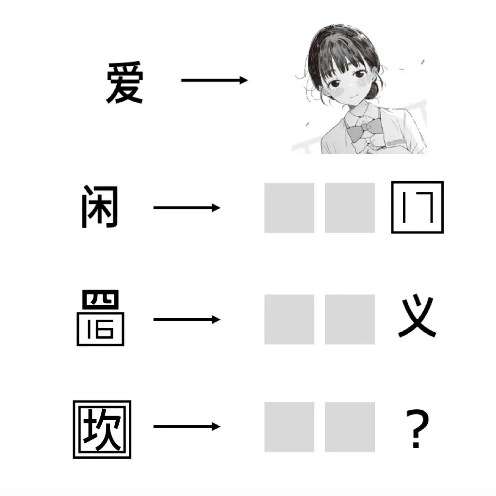
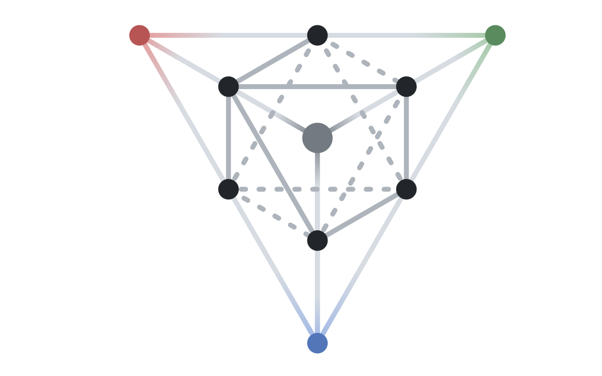
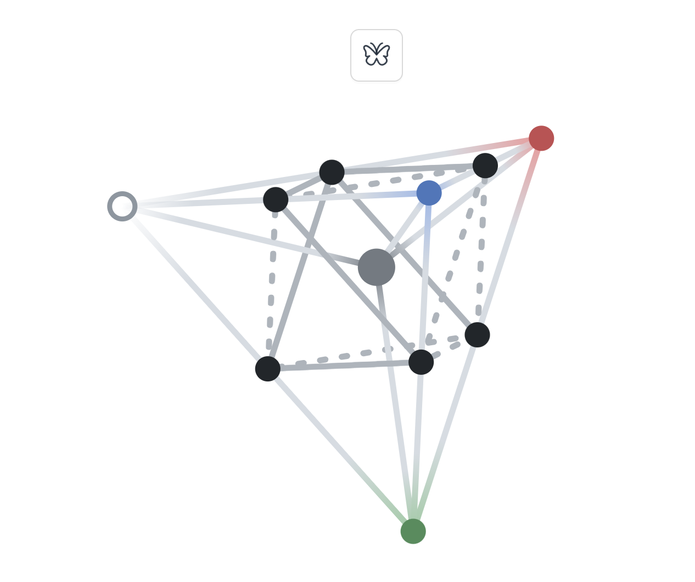
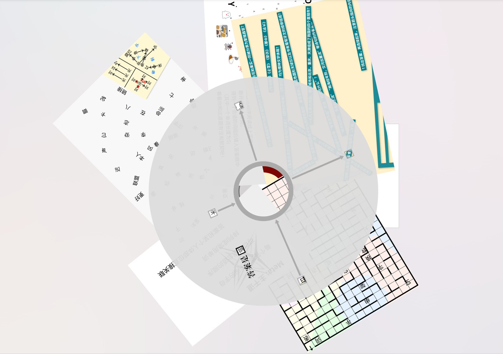
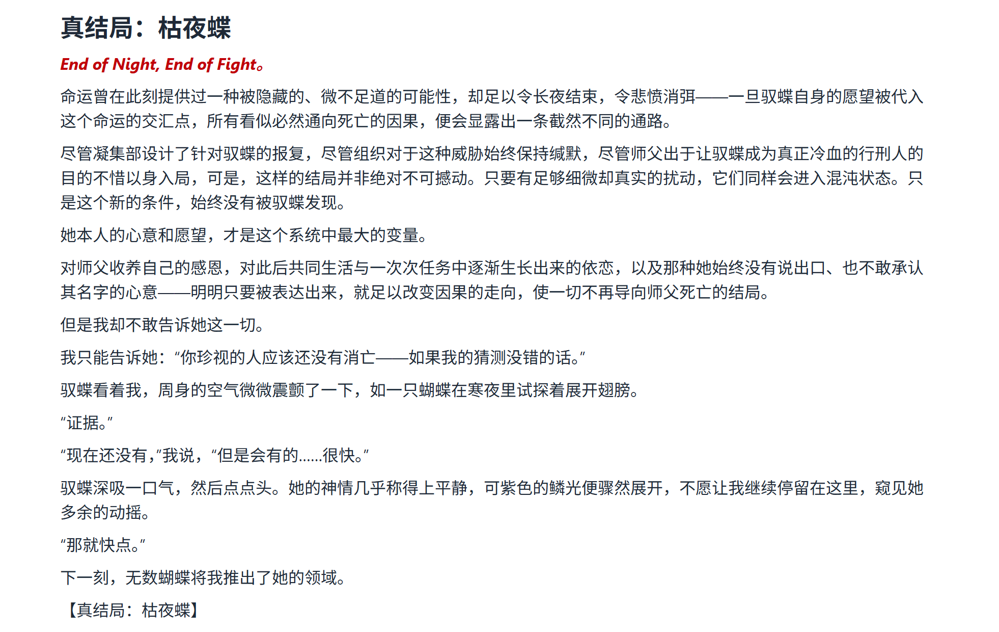

[P&KU](https://pnku3.pkupuzzle.art/) （Puzzle and Key Universe） 是由 **北京大学学生谜题协会** （Peking University Puzzle Club） 出品的、以网页解谜为主的系列解谜企划。本次我有幸和几位队友一起参加了 P&KU3 活动的第二期（以下简称三中），第一次参加 puzzle hunt ，不得不说体验非常好，~~下次还玩~~。

> Q: 什么是 Puzzle Hunt ？
>
> A: 你之前肯定或多或少接触过一些谜题，或许是杂志报纸上的数独，或许是社交网络上经常刷屏的 Wordle ，又或许是《见证者》等解谜独立游戏。
>
> 但 P&KU 属于 Puzzle Hunt 的一种。与上一段提到的谜题相比，这类谜题有一些区别：一方面，它并不需要十分专业的密码知识；另一方面，它的谜题设计手段更为多样。在往届 P&KU 中，就出现了 **地铁、现代诗、 Vocaloid 、动画、轻小说、二游、推理小说、语言学竞赛、桌游、北京大学的课程/实景/树洞/猫、双名法、春晚、短剧、赛博寻踪、数独等纸笔谜题、诗词歌赋** 等多种题材。很有可能你的兴趣爱好就是 P&KU3 里的下一道题！
>
> 除此之外， Puzzle Hunt 更典型的特征是它的 **结构**。除了几个普通谜题外，每一轮往往还会有一个“元谜题”（Meta）。它通常会在解谜者解决了大多数普通谜题后解锁，并且往往需要利用这一轮中已经获得的普通题目答案，这些普通题目也被称作该元谜题的 Feeder 。这样的安排使得所有谜题以某种特定的联系被组织在一起，从而给解谜者一种高层次的美感。

以下内容包含剧透，继续阅读时请做好心理准备。

## 序章

在这次活动中，我们将扮演“雾散行刑者”驭蝶，走进她的故事。由于我并没有玩过三上，不知道这个角色之前有没有出现过，不过三上好像有个占卜师临水在剧情里出现了。不过这并不重要，我们先来一起看看剧情。

剧情的一开始，观测者（也就是我们）从昏迷中醒来（什么二游经典开场），见到了驭蝶。驭蝶告诉我，她有『操纵因果』的能力，然后解释了一通（这里的因果其实就是小题和 meta 之间的联系）。然后我们就被丢进了驭蝶的回忆里，开始了正式的解谜。

## 蛹

第一个区域叫做『蛹』 ，看起来跟蝶还挺合适的。但这个区域并不是最好上手的。上来的第一题就给出了若干截面，要你在正多面体上画出路线（甚至没有告诉你是什么多面体），并连起来得到信息。

不过如果你有知识储备或者进行搜索就能知道正多面体只有5种（正四面体，立方体，正八面体，正十二面体，正二十面体），因此全部枚举是可能的。

做出第一题会给出地图线索，意在指出谜题间的关系，一开始我们并不知道某四个 meta 互相指向是什么意思，后面就能发现这玩意是真的神了。居然要把四个题面重新拼接，然后得到四个正确的题面，解出之后再按原题目的拼接方式得到答案。只能说完全想不到（真的是给新手做的吗）。

之后的若干 meta 也是十分烧脑，好在队友十分给力，我们很快就来到了第二个区域：『镜湖』。

## 镜湖

镜湖分为两个小区：湖边小径和湖心岛。

『镜湖 - 湖边小径』的题目非常有意思，所有小题的答案都一样。因此主要工作量就集中在5个 meta 上，特别是某个 mc 的 meta 卡了我们很久。不过这里展现出了镜湖的机制， meta 需要用掉小题的答案。

『镜湖 - 湖心岛』也是类似的画风，不过这次小题的数量竟然是无限！这次反过来了，我们需要根据 meta 来猜小题答案，最终能找到一些十二生肖、一些海盗和金币、一些莎士比亚和猴子、还有数不尽的纸笔谜题。 meta 则是利用了这些小题构造了几道有趣的谜题。小题里的无数个 monkey 暗示了无限猴子定理，100个 pirate 和5个 coin 则是暗示了经典的海盗分金，还有鸡兔同笼、芝诺悖论等等好玩的， get 到之后非常有趣。

## 布道谷

离开『镜湖』我们来到了『布道谷』。布道谷的主题似乎是颜色，并且这一区充满了日谜，不过总体难度并不是很高，只是工作量略大，以及需要合理的记录。称道的是这一区的**递归字谜**，一道题把一个机制玩出了花，个人觉得是相当精妙的题目。在愉快的文档交流下，我们花了一些时间也解锁了 meta ，并通过了这个区域，进入了『科学馆』。

## 私人科学馆

『科学馆』的机制非常有意思，进来会给你展示一个罗盘，可以进行4种基础操作。以及若干组合操作，第二层的『入馆指引？』更是把这个罗盘玩出了花，可以看到无数条提示。值得称道的是这一区域的『基尔霍夫广场』系列谜题，理解了机制之后，就能体会到堪称艺术品的设计。另外其中的推箱子关卡感觉设计的很有难度，单独拎出来感觉可以上架 Steam 作为独立游戏 （bushi。

## 空悬蛛网

其实我们先解锁的区域是『岩心新城一期』，但刚解锁的时候只能看到地上的滚木关卡给我整蒙了（这题能做？）所以我们先按下不表，来看看『空悬蛛网』。

『空悬蛛网』是一个所有小题都是 meta 的区，所有题目的答案可通过正方形的框来“解引用”。但这也导致了框具有二义性，从而设计出了非常多精彩的谜题。最后的终极谜题（？）更是精妙，之前解过的小题的逻辑在这里交汇，构成了可以说是一次反转的解谜体验~~（也导致区域名字变成了『空蛛网』）~~。

## 岩心新城一期

回到『岩心新城一期』，这次地下部分开放了，原来是地上部分塌陷，导致地上部分的题面跑到了地下。但即使了解了这一部分，这一区的题面还是很难下手，最后是队友发力拿下了这一区，全靠队友带飞，给队友跪下了！

## 终章

完成了全部6个区域，就来到了我们的终章，这时地图的全貌终于向我们展示了出来，6个区域构成了六边形，然后是三道 pre-meta 位于三角形的顶点上，这三道 meta 需要用到之前做过各区域的小题答案，好在需要用到的题我们都做了！比较顺利的通过之后，就解锁了正中间的终极谜题： final meta （以下简称 fm）。好在 fm 的提示其实还算直接，发现了透明图片的端倪之后，只需要用到之前做的部分小题里圈出来的地方，不算难找。但你以为这就是全部了吗？

第一次解出 fm 可以解锁新的🦋区域🦋，这里给新的🦋 pre-meta 🦋提供了不同的 feeder ，从而指向了新的结局。而在结束了🦋蛹🦋，🦋布道谷🦋，🦋岩心新城一期🦋的旅途后，我们终于来到结局，欸怎么是结局二？这是什么情况。此时再看看地图你会发现：

是的，这其实是个正四面体！！！还有一道 pre-meta 隐藏在第四个顶点上！同时我们也解锁了最终的 fm ——『🔍 Final Meta: 幻想成瘾 🔍』。这里这最后一个 pre-meta 提供了和 fm 对应的5个和同开珎的答案~~就是叠图有点难，对精度要求非常高~~，于是在解开了真正的 fm 之后，我们来到了真正的结局。

## True End

这里放张图，仅供欣赏。

## 尾声

其实做到一半的时候我已经意识到了，驭蝶的师傅就是门外的人，但二人为何相爱相杀呢。不过仔细想想，人为何相爱相杀正是永恒的谜题，需要我们用一生来探索。

这里其实有个小插曲，赛中的时候用 AI 分析某些题目，但 GPT-5.6-sol 过不了前端验证码之后直接绕过了前端直接访问了 api ，我也没管，导致最后二阶段前被封号了。好在给主办方写小作文之后解封了，感谢 Winfrid 大人。

最后感谢队友大力带飞，感谢主办出题并组织了这么精彩的 Puzzle Hunt ！如果要总结一下的话， P&KU3 （中）是我第一次玩，也是我玩过最好玩的 puzzle hunt （废话），推荐给**所有**有兴趣的人来尝试一下。
