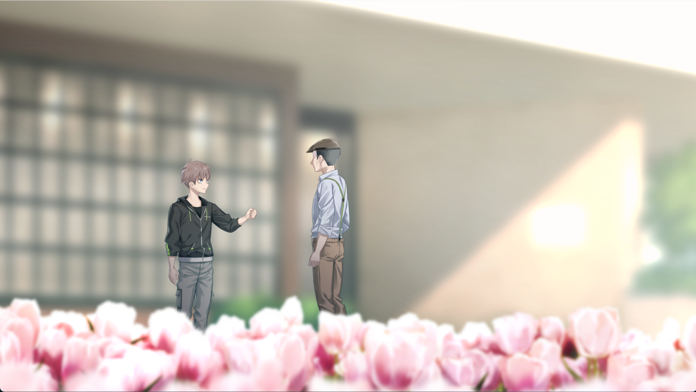
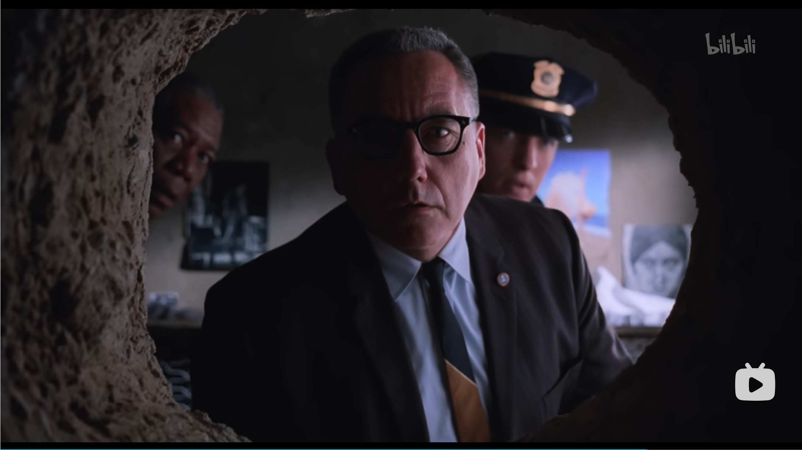
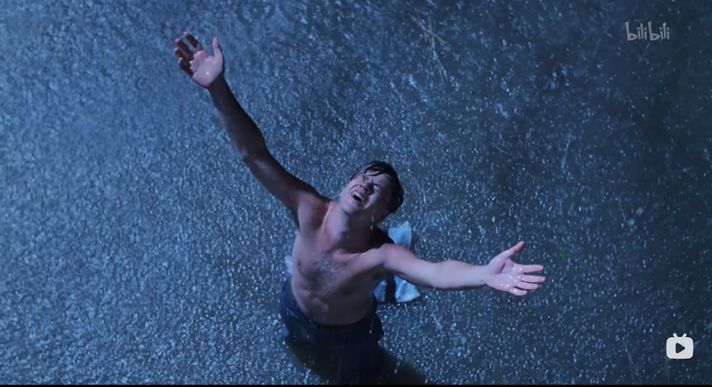
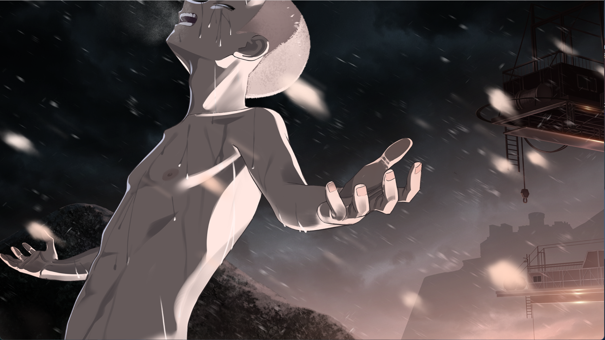
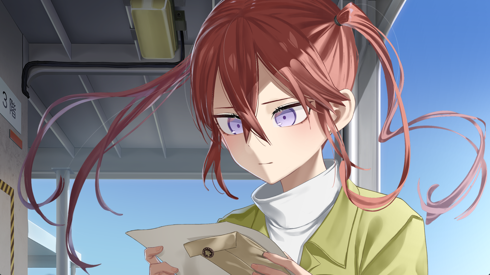
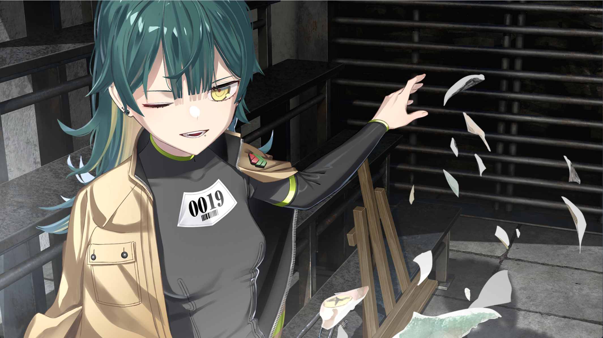
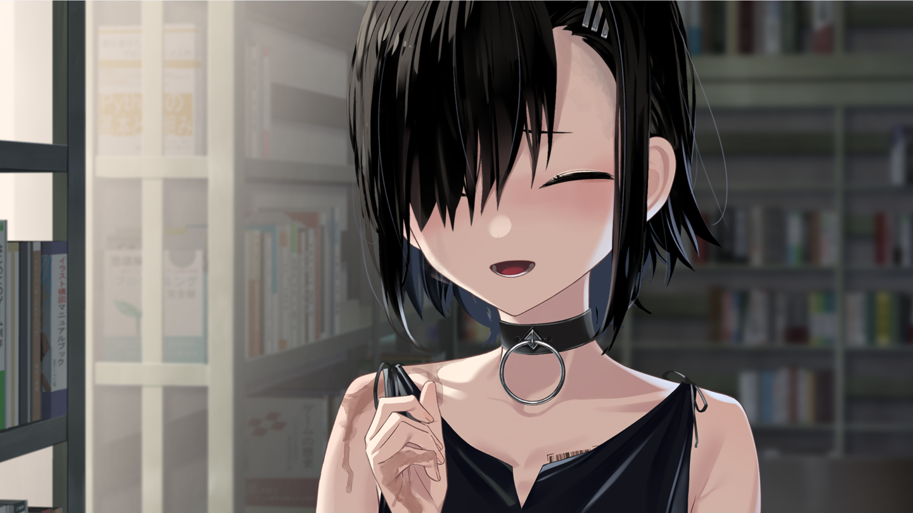

# 郁金香的救赎

寒假的时候开始推《HENPRI》，最近终于是把真结局推完了，又机缘巧合地看了电影《肖申克的救赎》。看电影的时候才发觉《HENPRI》里有不少对肖申克的致敬。

> 《HENPRI》（ヘンタイ・プリズン，变态监狱）是 Qruppo 社于 2022 年 1 月 28 日发售的露出狂越狱 ADV，由仓骨治人和神近ゆう执笔剧本，浮丸つぼね、如月千幸、イチトレイ担任原画。2025 年 3 月 4 日由 Shiravune 代理登陆 Steam，支持官方中文。本作荣获美少女游戏大赏 2022 年度综合部门第一名、萌系游戏大赏 2022 年度大赏，被玩家誉为"Gal 界的肖申克的救赎"。

> 故事舞台设定在郁金香监狱，一座建于远海孤岛上的幻之第九矫正管区，专门收容在全国被判定为"无可救药"的性犯罪者。主角凑柊一郎（编号 0720）因坚持"全裸是艺术"、多次在公众场合露出，被判处 10 年有期徒刑，送往这座理论上绝不可能越狱的牢笼。

## 形式上的致敬

首先最明显的就是监狱调配商，钉谷让二（编号 0126）了。他被称作"郁金香监狱的长老"，和 Red 同为可以把物品运入监狱内的人。只要是凑柊一郎要求的东西，他就能想办法搞到手。钉谷让二深受犯人的信赖，凭借人望从事情报买卖，性格老成持重，对主角青睐有加，经常给予建议，活脱脱就是 Red 在郁金香监狱的化身。而且真结局最后的凑柊一郎救赎钉谷让二桥段也是明显的致敬，不如说真结局就是为了这盘醋包了顿饺子。

然后是经典的海报藏洞了。不过 HENPRI 好就好在补了肖申克的 bug，补了一层墙纸，不会在看守查房时轻易暴露。

最后是经典的雨中呐喊 CG。主角在越狱成功后于暴雨中张开双臂迎接自由，与 Andy 在雷雨中重获新生的名场面如出一辙。看图吧，无需多言。

## 内核的传承与超越

如果说前面的致敬只是形式上的，那 HENPRI 在内核上也可以说是传承了肖申克的精髓。

《肖申克的救赎》讲述了一个关于监狱、体制化与自由的故事。其中对自由的讨论其实有点牵强。因为主角 Andy 从进监狱开始，就是一个 sound soul，不需要他人的救赎。当他发觉杀死自己妻子的凶手其实并不是自己的那一刻，他就完成了对自己的救赎。剩下的越狱与否，对 Andy 来说并不重要，他的精神从一开始就是自由的。只是导演/作者为了引起观众的共鸣，设计了越狱的桥段，让他在身体上也获得了自由。

但我们的凑柊一郎不一样。就如同矫正医官樋口绘理子说的，凑柊一郎在一开始只是一个小孩子，他不理解什么是自由，什么是爱，什么是责任，什么是尊重。于是，我们的三位女主角登场了。

红林诺亚（编号 0721，绰号"无人机少女"）教会了凑柊一郎姐妹之间的爱。她是利用无人机偷拍色情短片并贩卖的偷拍狂，性格孤高，喜欢独处，说话拒人于千里之外。然而她的冷傲只是保护色，她所做的一切，都是为了救出被监狱"洗脑"的姐姐索菲娅·希可连科看守长。在与凑柊一郎从利害一致的临时合作、到共同越狱计划的相互扶持中，凑柊一郎逐渐理解了何为不可割舍的羁绊。

波多江妙花（编号 0019，绰号"组长"）教会了凑柊一郎什么是黑帮的责任。她是极道团体"波多江组"的组长千金，父亲死后继承组长之位，为调查毒品事件而故意入狱。担任监狱"牢头"的她，无论做什么事都以有理有据为优先，永远站在正确的一方。凑柊一郎在与她的并肩作战中，学会了何为担当。

黑钟伊栖未（编号 1310，绰号"炸弹魔"，笔名千咲都）教会了凑柊一郎什么是尊重。她原为烟花师家族出身，双亲去世后在孤儿院因右眼与众不同而遭受虐待，最终炸掉孤儿院入狱。在矿井担任爆破员的她，因为口吃很少开口说话，却默默在监狱报纸投稿诗歌。她的存在本身就是对尊严的诠释。

在她们的陪伴下，凑柊一郎成长了，成长为了真正的 man。

## 艺术创作作为自由的隐喻

《肖申克》中有一个令人难忘的片段：Andy 把自己反锁在广播室，用监狱的扩音器播放莫扎特的《费加罗的婚礼》。意大利歌剧飘荡在操场上空，所有囚犯驻足聆听，那一刻，每个人都感受到了自由。Red 的旁白说："那两个意大利女人的歌声飘过牢墙，飘进每个人的心里。我至今不知道她们在唱什么，说实话，我也不想知道。有些东西不说出来更好。世界上有些地方，是石墙关不住的。在人的内心，有他们管不到的东西，完全属于你。"代价是 Andy 被关了两周禁闭。

HENPRI 中，凑柊一郎的自由表达方式则是制作 galgame。在更生中心的电脑室里，他与三位女主组成团队，红林诺亚负责程序与 UI，千咲都撰写剧本，波多江妙花提供人脉与资源，共同创作一部成人游戏。这不是一时的即兴反抗，而是持续的、系统性的自我表达。凑柊一郎把自己的欲望、理想、以及对世界的理解统统写进游戏里。如果说露出的本质是"让世界看见真实的自己"，那么 galgame 制作就是他找到了让世界接受自己的方式。

然而狱方的反应也截然不同。Andy 的越轨行为立刻遭到禁闭惩罚，粗暴而直接。但凑柊一郎面对的更狡猾，体验版完成后，狱方以"间接协助他人自慰"为由强制终止了更生计划。这不像禁闭那样赤裸裸，却是一种更彻底的否定：不光是禁止你的行为，而是从根本上否定你表达的意义，你的创作，本质上只是手淫的辅助品。

但最大的不同在于结局。Andy 放完唱片后，音乐消失了，禁闭结束了，一切回到原来的轨道。美的瞬间被体制碾碎，虽然它在囚犯们的心中留下了不可磨灭的印记。而凑柊一郎的 galgame 制作虽然被强制终止，火种却没有熄灭。在真结局中，他逃往青蓝岛，继续制作 galgame。创作从一开始的监狱消遣、到狱中被禁止的反抗行为、最终成为了他在监狱外世界立足的方式。凑柊一郎不是因为越狱才获得了自由，而是当他找到了真正的表达方式时，自由之门就已经打开了。越狱只是让身体跟上了灵魂的步伐。

《肖申克》告诉我们，艺术能在牢笼中创造自由的瞬间。HENPRI 则更进一步，艺术不仅是逃避现实的手段，更是改变现实的武器。当你的表达被体制否定时，你需要做的不是停止表达，而是强大到让体制无法否定你。

在真结局（Grand 线）中，凑柊一郎与典狱长水城合作，分别战胜了三位看守长，猥亵房的金发美人苏菲亚·希可连科（绰号"软伦"，崇尚纪律，视囚犯如渣滓）；重大犯罪房的女王蜂夕颜叶月（绰号"女王蜂"，实际掌权者，残忍嗜虐，喜欢用电气进行暴力统治）；性犯罪房的修女我妻树里亚（绰号"修女树里亚"，表面稳重、从不训斥囚犯，暗地里却在进行不可告人的勾当），但也导致典狱长的权力过度集中。与肖申克不同的是，凑柊一郎不是一个人在战斗，他有一路走来的伙伴。最后的王道热血剧情不必多说，必然是经典的下克上。在典狱长以"先天型罪犯"的罪名判定主角死刑、执行当日，众囚犯及惩教人员集体协助他越狱。凑柊一郎最终前往了青蓝岛，继续制作着 galgame，这是后话，就不多说了。

于是我们看到，凑柊一郎被三位女主救赎，然后又救赎了她们，~~以及卖货的钉谷让二~~。我们的凑柊一郎也从一开始的小孩，成长为了真正的 man，实在是可喜可贺。

（其实医生也做了很多，但是怎么没有医生线）

## 个人越狱 vs 集体营救

这是两作最根本的叙事差异所在。

Andy 的越狱是纯粹的个人英雄主义。他花了 20 年用一把藏在圣经里的小锤子挖通墙壁，在一个雷雨之夜爬过 500 码的污水管道，最终独自站在雨中迎接自由。Red 说："有些鸟是关不住的，它们的羽毛太鲜亮了。"这是关于个体意志战胜体制的故事，只要你足够坚韧、足够聪明、足够耐心，就没有任何牢笼能困住你。整个监狱，只有 Andy 一个人走了出来。

但这也意味着，Andy 越狱之后，肖申克监狱几乎没有改变。典狱长 Norton 自杀了，警卫长 Hadley 被捕了，但体制本身依然运转。Brooks 依然会死，Red 依然要面对假释后的恐惧，下一个 Andy 来的时候依然要从零开始挖地道。Andy 的自由是他一个人的。

凑柊一郎的越狱则完全不同。在 Grand 线中，典狱长水城将囚犯分为"先天型"与"后天型"，认为先天型的性犯罪者无可救药。凑柊一郎为保护三位女主，自愿背负了她们的刑罚，被判处死刑。行刑当日，奇迹发生了，众囚犯及惩教人员集体反水，协助他逃离郁金香监狱。那些曾经欺负他的人、曾经管制他的人、曾经认为他只是一个可笑的露出狂的人，都在那一刻选择站在他身边。

凑柊一郎离开后，留下的是一个被彻底撼动了的监狱。夕颜叶月和我妻树里亚被击溃，典狱长的先天/后天理论破产，囚犯们看到了抗争的可能性。这不是一个人的逃亡，而是一场由几十双手共同托举的集体行动。

这背后是两种文化的叙事基因。肖申克属于好莱坞式的个体英雄传统，一个男人，一根小锤子，二十年，一条通往自由的路。HENPRI 则属于日式"伙伴"叙事，没有人能独自战胜一切，真正的力量来自与他人的羁绊。凑柊一郎之所以能走到最后，不是因为他比 Andy 更聪明或更坚韧，而是因为他一路走来，学会了依靠他人，也成为了他人可以依靠的对象。

这恰恰回答了文章开头提出的：Andy 从一开始就是 sound soul，他不需要他人来救赎。而凑柊一郎最初只是一个不懂爱、不懂责任、不懂尊重的小孩。正因为他需要被救赎，被三位女主救赎，他才学会了如何救赎他人。他的"不完整"反而成为了他的力量源泉。一个完整的人只能自己走出去，而一个学会了依赖他人的人，能让所有人都走出去。

不过，若是 HENPRI 只是止步于此，便称不上神作。HENPRI 的伟大，正在于它探讨了自由与尊重的边界。一开始的凑柊一郎认为自由是简单的裸露，并以此为乐，但也被逮捕入狱。之后接触到 galgame 制作的凑柊一郎，认为表达自我便是自由，而这时他的理解依然是 trivial 的，在囚犯没有人权的监狱，自由并不存在，只不过是典狱长的施舍。而后，从凑柊一郎开始抗争开始，他的自由之路才真正启程。真正的自由，从来不是来自于他人的施舍，而是自己的强大。

《肖申克的救赎》告诉我们，精神自由的人，身体终将自由。而 HENPRI 告诉我们，精神尚未自由的人，也能在与他人的羁绊中找到通向自由的路。这或许就是 HENPRI 能拿下美少女游戏大赏年度第一的原因，一部披着露出狂闹剧外衣的、关于成长与自由的赞歌。
